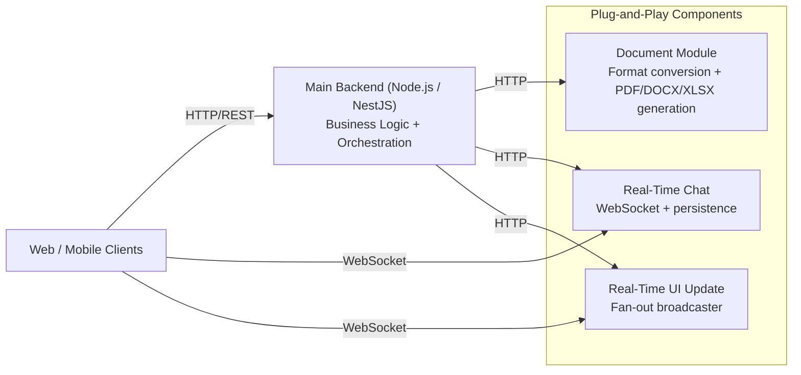

# Plug and Play Backend Architecture Components Collection (Optimized, Reliable, Secure)

Modern backend systems are easier to evolve when they are built as modules: small, well-defined components with clear responsibilities and interfaces. A modular approach improves reuse across products, reduces blast radius when changes are needed, enables independent scaling and deployments, and makes performance and security hardening more focused and testable.

A growing collection of backend building blocks: generic, production-oriented architecture components designed to be “plug and play”.

The goal is to keep business logic and product development fast (using modern stacks like Node.js/TypeScript and frameworks such as NestJS), while moving CPU-bound and latency-sensitive workloads into small, dedicated services written in a compiled, high-performance language (currently Go).

In practice:
- Node.js (or any modern backend stack) acts as the orchestration / “glue” layer.
- This collection provides independent Go microservices that implement performance-critical capabilities.
- Each module is designed to be dropped into an architecture, configured with a small set of environment variables, and deployed as a container.

## Example architecture

The diagram below shows a common setup where your main backend (Node.js/NestJS or similar) stays focused on business logic, while CPU-bound and high-concurrency capabilities run as separate components.

## What “plug and play” means here

These components are intended to be easy to integrate:
- Clear HTTP/WebSocket interfaces.
- Minimal configuration (typically via `.env` variables for things like JWT verification, shared secrets, ports, and backing services).
- Docker-first local dev and deployment via `Dockerfile` / `docker-compose.yml`.

The intent is not to replace your main backend. The intent is to offload specific responsibilities (high concurrency, heavy transformations, fan-out broadcasts, etc.) into focused modules that scale well and stay maintainable.

## How to use components

Each component is self-contained and can be run independently.

General workflow:
1. Choose the module that matches your architectural need.
2. Run it locally with Docker Compose (recommended) or run it directly with Go.
3. Configure required environment variables (for example `JWT_SECRET`, shared time-token secret, database URL).
4. Integrate from your main backend using HTTP calls and/or WebSocket clients.

Most modules expose:
- A health endpoint for readiness/liveness.
- One or more “public” endpoints (client-facing) and “private” endpoints (backend-facing).

## Component index

- Document Module Microservice — high-performance payload conversion + PDF/DOCX/XLSX generation: https://github.com/SantiagoLopezDeharo/document-module-microservice
- Real-Time Chat Microservice — WebSocket chat with MongoDB persistence and JWT auth: https://github.com/SantiagoLopezDeharo/real-time-chat-microservice
- Real-Time UI Update Microservice — secure backend-to-UI event broadcasting via HTTP publish + WebSocket fan-out: https://github.com/SantiagoLopezDeharo/real-time-ui-update-microservice

## Components

### 1) Document Module Microservice

High-performance data format transformation and document generation.

What it does:
- Transforms payloads between formats (JSON, XML, CSV/TSV, TOML, YAML, MsgPack, XLSX, Properties).
- Generates documents from JSON instructions (PDF, DOCX, XLSX).

Typical use cases:
- Data ingestion pipelines (normalize partner payloads to a canonical format).
- ETL steps, integrations, and “conversion as a service”.
- Generating invoices, reports, exports, and spreadsheets without putting CPU and memory pressure on the main backend runtime.

Benefits:
- Focused service built for heavy processing workloads.
- Format negotiation via query params or headers.
- Streaming-oriented behavior to reduce memory pressure on large payloads.

Repository: https://github.com/SantiagoLopezDeharo/document-module-microservice

### 2) Real-Time Chat Microservice

Production-oriented real-time chat service using WebSocket for delivery and MongoDB for persistence.

What it does:
- One-on-one and group chat based on participant lists (order-independent).
- Single WebSocket connection per user receives messages for all channels they participate in.
- Async persistence to MongoDB with retry logic.
- JWT-based authentication and authorization.

Typical use cases:
- Chat inside marketplaces, customer support tools, back-office apps.
- Any system that needs reliable low-latency messaging plus storage.

Benefits:
- Clean channel model (participant-based) and simple authorization rules.
- WebSocket efficiency (no “one connection per channel” overhead).
- Docker Compose setup for quick local boot (service + MongoDB).

Repository: https://github.com/SantiagoLopezDeharo/real-time-chat-microservice

### 3) Real-Time UI Update Microservice

A plug-and-play real-time update broadcaster that helps distributed systems push events to UIs without bloating the main backend.

What it does:
- Backend publishes an update with a simple HTTP request.
- The microservice validates the request using a shared secret and a time-based token.
- Broadcasts payloads to connected WebSocket clients in parallel (designed to avoid slow clients blocking everyone).
- Supports channel-scoped updates and separation between authenticated and public connections.

Typical use cases:
- “Live” dashboards, operations consoles, order-status feeds, notifications.
- Distributed architectures where the main backend should not manage large numbers of WebSocket connections.
- Region-based deployment for global apps (deploy a node per region and broadcast locally).

Benefits:
- Keeps the main backend focused on business logic.
- Reduces Node.js event-loop pressure (or similar runtime constraints) by moving fan-out broadcasting into Go.
- Security model for service-to-service publishing (shared secret + time-windowed token).

Repository: https://github.com/SantiagoLopezDeharo/real-time-ui-update-microservice

## Docker and deployment

Every module in this collection is designed to be containerized.

Recommended:
- Use the module’s `docker-compose.yml` for local development.
- Use the module’s `Dockerfile` for CI builds and production deployments.

This makes the modules easy to:
- Run side-by-side with your main backend during development.
- Deploy independently and scale them horizontally where needed.
